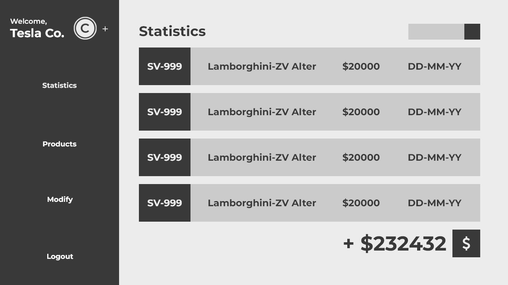
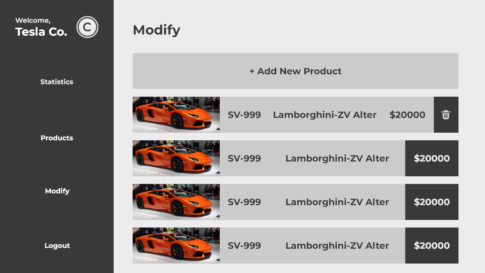
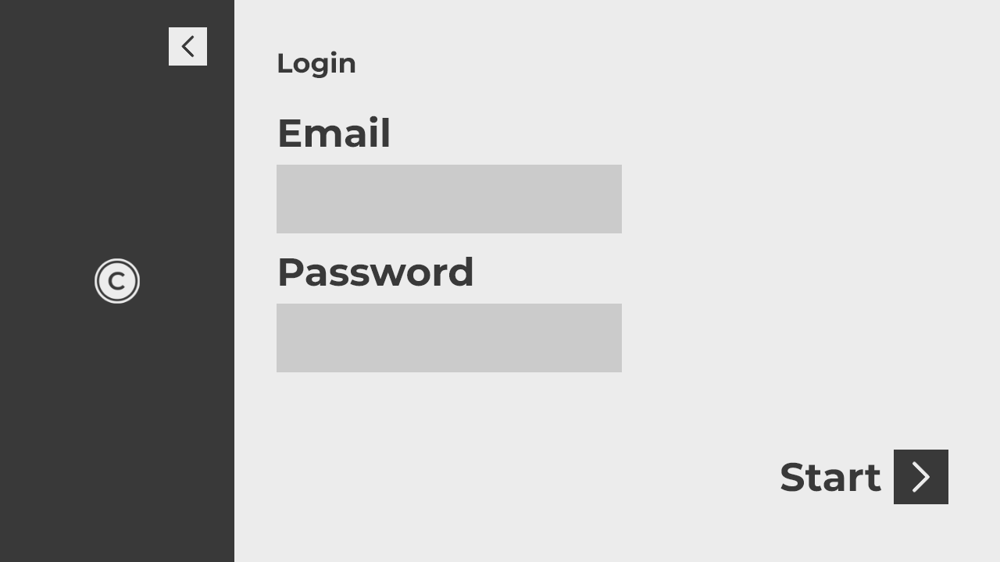
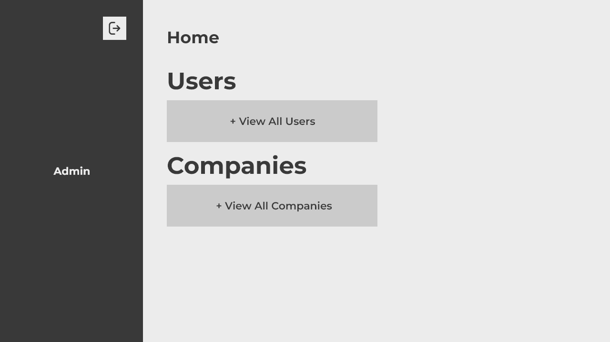

# Car Dealership Software - Java

## Description

The Car Dealership Software is a comprehensive application built using Java, Java Swing, and SQL (Oracle SQL Developer) to streamline car dealership operations. The software caters to three main sides: Admin, Companies, and Customers, each equipped with specific functionalities for efficient management and operations.

### Admin Side
- The Admin side provides a centralized dashboard to oversee the entire car dealership system.
- View all new customers and companies added to the system.
- Access sales and purchase records for better analysis and decision-making.
- Perform advanced search operations to find specific information.
- Generate detailed reports to gain insights into the overall dealership performance.

### Companies Side
- Companies can manage their inventory, showcasing the cars available for sale.
- Modify and update car information to keep the inventory up to date.
- Monitor and manage sales records, tracking customer purchases.
- Utilize advanced search functionalities to find specific car models or customer details.
- Generate reports to assess sales performance and other key metrics.

### Customers Side
- Customers can browse available cars and make purchases based on their preferences.
- View their purchase history for reference and future transactions.
- Perform searches to find specific car models or previous purchases.
- Generate reports to track their own purchase history and analyze preferences.

## Technology Stack

- Java for the core application logic and functionality.
- Java Swing for building the graphical user interface (GUI).
- SQL for managing the database and handling data.
- Oracle SQL Developer for database administration.

## Installation

1. Clone the repository to your local machine.
2. Ensure you have JDK (Java Development Kit), Java Swing, and Oracle SQL Developer installed.
3. Import the provided .json schema for Oracle SQL Developer Connection.
4. Open the project using an IDE like IntelliJ or NetBeans.
5. Make any necessary adjustments to the absolute paths of the pictures within the program.

```bash
git clone https://github.com/theArtistSam/Java-CarDealership-Project.git
cd Java-CarDealership-Project
```

## Usage

1. Launch the application using your chosen IDE (IntelliJ or NetBeans).
2. Log in using the respective credentials for Admin, Companies, or Customers.
3. Explore the various functionalities available to each user type.
4. Perform searches, generate reports, and manage car dealership activities.

## Note

1. The Car Dealership Software must be compiled and run using an Integrated Development Environment (IDE) like IntelliJ or NetBeans. The provided .json schema for Oracle SQL Developer Connection should be imported into the database to ensure proper functioning.
2. Make sure to create Maven project and use above two API's (iText and OJDBC)
3. Due to the usage of absolute paths for pictures within the program, please make necessary adjustments to the picture paths based on your local environment setup.

## User Interface





